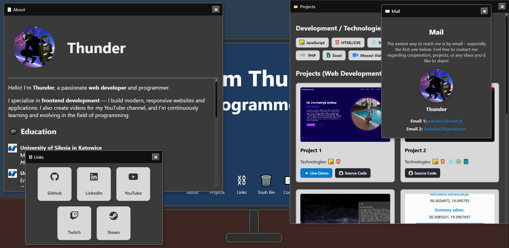

## Try the Demo  
👉 [**Try the demo!**](https://thunderstorm24.github.io/MiniDesk)

---

# MiniDesk  

 
 

**Interactive Desktop Portfolio**

---

## About the Project  
**MiniDesk** is an interactive web portfolio presented as a virtual computer desktop.  
Users can interact with the desktop just like with a real system — clicking on icons, opening windows, moving them around, and exploring different sections such as **About**, **Projects**, **Links**, **Contact**, and more.

The goal of this project is to transform a traditional portfolio into a playful and creative experience, where your website feels like a functional little computer sitting on a desk.

---

## Features  
- **Interactive windows** — open, move, and close different app-like windows on the screen.  
-  **Light & Dark mode** — easily switch between two visual themes.  
-  **Sound effects** — toggle sound feedback on or off for actions like opening and closing windows.  
-  **Desktop simulation** — feels like using a real mini operating system.  
-  **Explore content** — read about the author, browse projects, follow links, and check contact info — all inside draggable desktop windows.  

---

##  Screenshots  

### Desktop View  
The main interactive desktop with clickable icons.  

### Open Windows  
Multiple draggable windows showing About, Projects, and Links sections.  

### Power Off Mode  
Turn off the virtual monitor with the button in the bottom-right corner.  

---

## Summary  
**MiniDesk** is more than just a portfolio — it’s a personal digital space that mimics a desktop computer.  
It’s a creative, interactive way to showcase your projects and personality while giving visitors something fun and memorable to explore.
